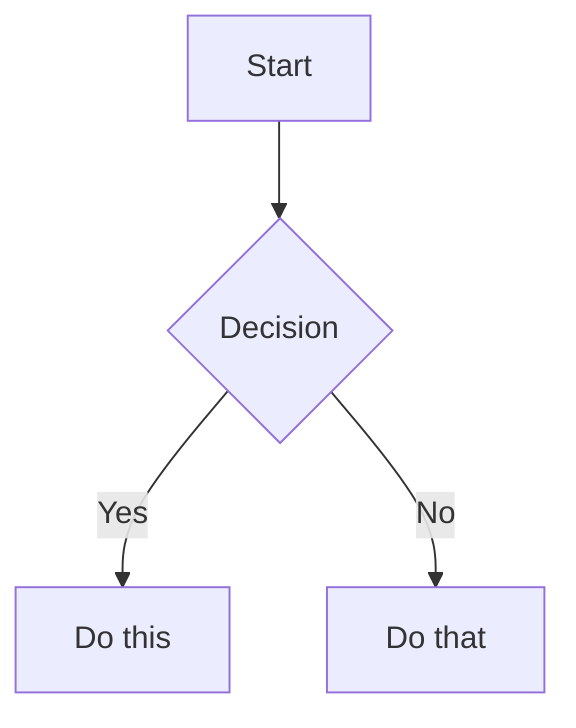

# Obsidian Markdown

Obsidian extends CommonMark and GFM with wikilinks, embeds, callouts, properties, comments, highlights, math, Mermaid diagrams, and footnotes. Standard Markdown syntax is assumed knowledge.

Vault-specific rules override generic Obsidian defaults: do not add YAML properties/frontmatter by default, and use wikilink tag stub notes for primary organization unless the user asks for native `#tags`.

Use `[[wikilinks]]` for notes within the vault because Obsidian tracks renames automatically. Use `[text](url)` for external URLs.

## Internal Links And Blocks

```markdown
[[Note Title]]
[[DBT Marts|Marts]]
[[Note Title#Heading]]
[[#Heading in same note]]
[[Note Title#^block-id]]
```

Define a block ID by appending `^block-id` to a paragraph:

```markdown
This paragraph can be linked to. ^my-block-id
```

For lists and quotes, place the block ID on a separate line after the block:

```markdown
> A quote block

^quote-id
```

## Embeds

Prefix a wikilink with `!` to embed its content inline. Use embeds for images, PDFs, audio, video, note sections, and block references when inline rendering is useful. See [Embeds](EMBEDS.md) for syntax and sizing.

## Callouts

Use `> [!type]` blockquote syntax for Obsidian callouts. See [Callouts](CALLOUTS.md) for types, aliases, folding, nesting, and custom CSS callouts.

## Properties And Native Tags

Generic Obsidian notes can use YAML properties and native `#tags`. In this vault, only add properties/frontmatter or native tags when the user asks, an existing note already uses them, or a source/template specifically requires them. See [Properties](PROPERTIES.md) for property types and native tag syntax.

## Comments And Formatting

```markdown
This is visible %%but this is hidden%% text.

%%
This entire block is hidden in reading view.
%%

==Highlighted text==
```

## Math, Diagrams, And Footnotes

```markdown
Inline math: $e^{i\pi} + 1 = 0$

$$
\frac{a}{b} = c
$$

Text with a footnote[^1].

[^1]: Footnote content.

Inline footnote.^[This is inline.]
```

Use Mermaid diagrams in fenced `mermaid` code blocks:

````markdown

````

To link Mermaid nodes to Obsidian notes, add `class NodeName internal-link;`.
