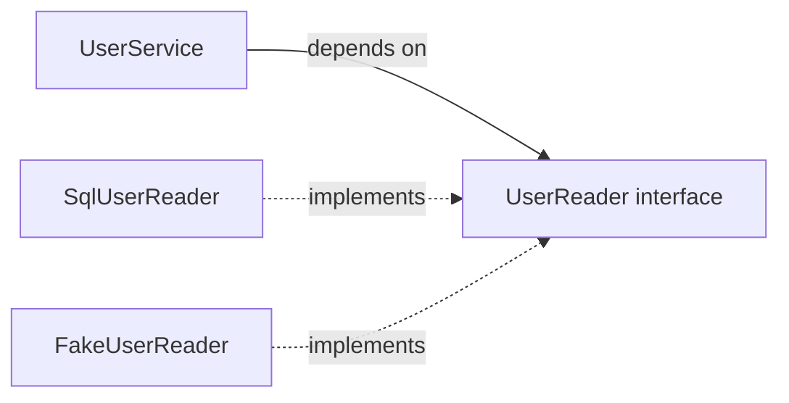
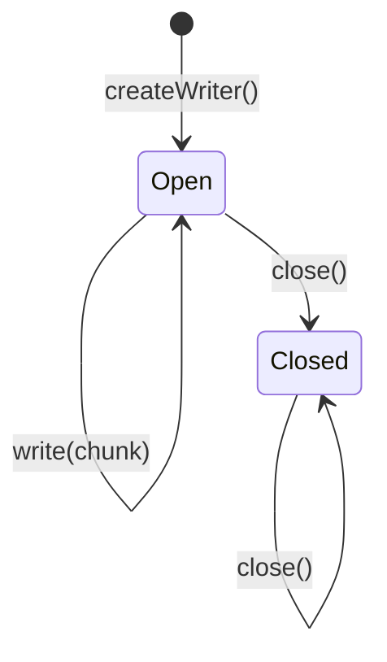
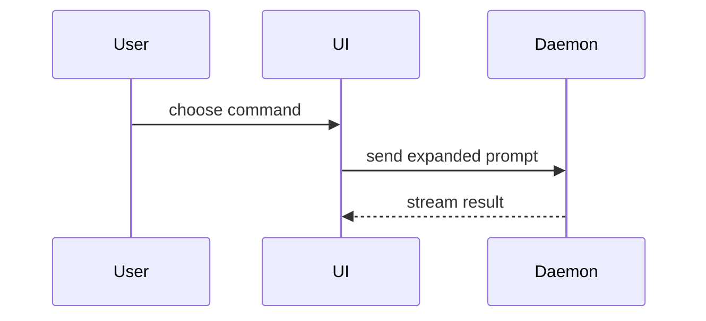

Help the user understand the current topic of conversation visually. Skip the preamble and keep prose brief. Pick the smallest view that makes the key point clear.

## Interfaces and low-level design

For an interface-only discussion, start with the public declarations and a small caller example. Keep method bodies and private fields out of that view. Use the project's language and actual names when available. Label proposed contracts and unresolved choices so the user can distinguish them from existing behavior.

Choose the view that answers the design question. The examples below are illustrative proposed APIs, not a checklist to render every time.

- Show a function's contract as a typed signature with adjacent annotations. Keep exact syntax in the code block; use a small diagram when the input/output boundary needs emphasis.

```ts
declare function loadUser(
  id: UserId,
  options?: { signal?: AbortSignal },
): Promise<User | null>;
```

```text
UserId ──────────────────┐
                         ├──► loadUser ──► Promise<User | null>
options.signal? ─────────┘                 ├─ User: found
                                          ├─ null: absent
                                          └─ rejects: read failed or cancelled

Effect: reads stored data; does not modify the user.
```

Include contract details that affect the decision, such as missing values, errors, side effects, ownership, or cancellation. Ground them in code or mark them as proposed. A return type alone may leave these promises unspecified.

- Show a class or interface as a compact declaration, followed by caller code that shows what the caller must supply and handle. Include construction or dependency injection when that is part of the question.

```ts
interface UserReader {
  get(id: UserId): Promise<User | null>;
}

declare class UserService {
  constructor(users: UserReader);
  displayName(id: UserId): Promise<string>;
}
```

```ts
const service = new UserService(users);
const name = await service.displayName(userId);
```

For example, state the proposed contract beside this view: `displayName` returns `"Unknown user"` when `get` returns `null`, and propagates read failures. This lets the user assess the API without reading its implementation.

- Show who depends on an interface with a small relationship diagram. Label arrows with their meaning. Keep runtime call order in a separate sequence diagram when it matters.



- Show lifecycle constraints as a state diagram when method availability depends on state. Put the contract for invalid calls beside it.



Proposed contract: `close()` is idempotent; `write()` after close throws `WriterClosedError`. This view makes legal call order visible without exposing internal state management.

- Compare API designs with aligned declarations or a focused diff, and show the same caller task under each option. Call out the changed responsibility or guarantee.

```diff
-reserve(sku: Sku, quantity: number): Promise<boolean>;
+reserve(request: ReservationRequest): Promise<ReservationResult>;
```

```ts
type ReservationRequest = { sku: Sku; quantity: number };
type ReservationResult =
  | { kind: "reserved"; reservationId: ReservationId }
  | { kind: "unavailable"; available: number };
```

```diff
-if (!(await stock.reserve(sku, 2))) showUnavailable();
+const result = await stock.reserve({ sku, quantity: 2 });
+if (result.kind === "unavailable") showUnavailable(result.available);
```

The new result lets the caller show how much stock remains. Show supporting types when they carry the design decision; keep unrelated types collapsed to their names.

## Other visual forms

- Show logic or an algorithm as pseudocode:

```text
on(save)
  if content is unchanged
    return cached result
  write new content
  return fresh result
```

- Show runtime control flow as a call tree:

```text
submitForm
  createSession
    persistPrompt
    launchAgent
  navigateToSession
```

- Show UI structure as a component tree, including state and module boundaries that matter:

```tsx
<SessionPage> (apps/example/src/routes/session.tsx)
  useSessionEvents()
  <SessionToolbar>
    <RunSkillButton> (packages/ui)
```

- Show file responsibility or a broad refactor as a shallow file tree:

```text
src/
├── commands/       # parses user actions
├── sessions/       # owns session state
└── transport/      # sends API requests
```

- Show component interaction, control flow, or data flow with Mermaid:



- Use `diff` when the point is what changes and the surrounding shape already exists. Match the diff shape to the topic.

For a component change:

```diff
 <SessionPage>
   useSessionEvents()
   <SessionToolbar>
+    <RunSkillButton />
   <SessionTimeline>
+    <SkillResultCard />
```

For a file-layout change:

```diff
 src/
 ├── commands/
+│   └── show-me.ts       # expands the slash command
 ├── sessions/
-└── transport.ts
+└── transport/
+    ├── client.ts
+    └── stream.ts
```

For a call-tree or call-stack change:

```diff
 submitForm
   createSession
     persistPrompt
+    expandSkillMention
     launchAgent
-  navigateToSession
+  navigateToSession
+    subscribeToEvents
```

For a state or control-flow change:

```diff
 on(save)
-  write content
+  if content is unchanged
+    return cached result
+  write new content
+  invalidate cache
```

- Show the whole block when most of it is new, when omitted context would hide ownership or order, or when the user needs a copyable target shape:

```ts
function expandSkill(command: string): string {
  const skillName = command.slice(1)
  return `use the ${skillName} skill`
}
```

- For a visual UI, layout, state comparison, or concept too dense for Mermaid, write one focused HTML file. Use a diagram, an infographic, or a short slide deck, whichever fits the point. For API exploration, an annotated signature with linked type details or a side-by-side contract comparison can help. Add interaction only when it clarifies a choice, such as switching between caller examples. Match the product's colors, type, spacing, and components; use real labels and data; support desktop and mobile. Then open it for the user:

```
Bash(open path/to/show-me-{description}.html)
```

## Guidance

Place each visual next to the short text it supports. Keep only the signatures, types, calls, files, props, states, and boundaries needed to answer the user's current question or the options to resolve the current discussion point.

You may use one of these, you may use several, it is unlikely you will use all of them. Use your judgement and don't overwhelm the user.
